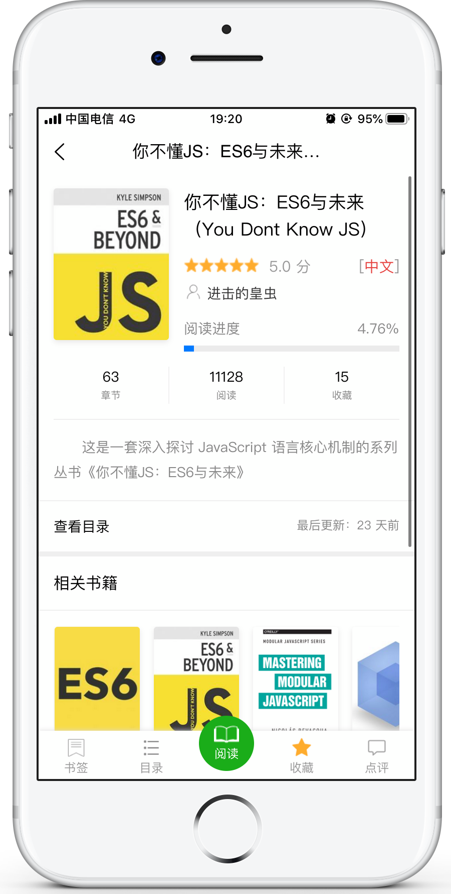
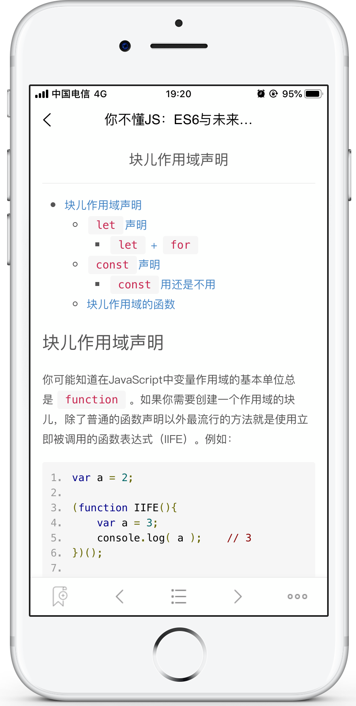
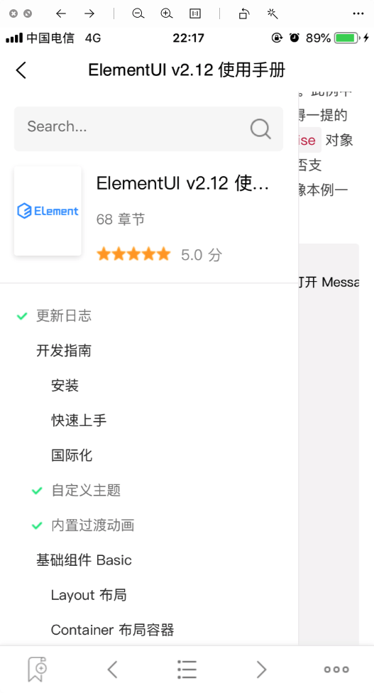
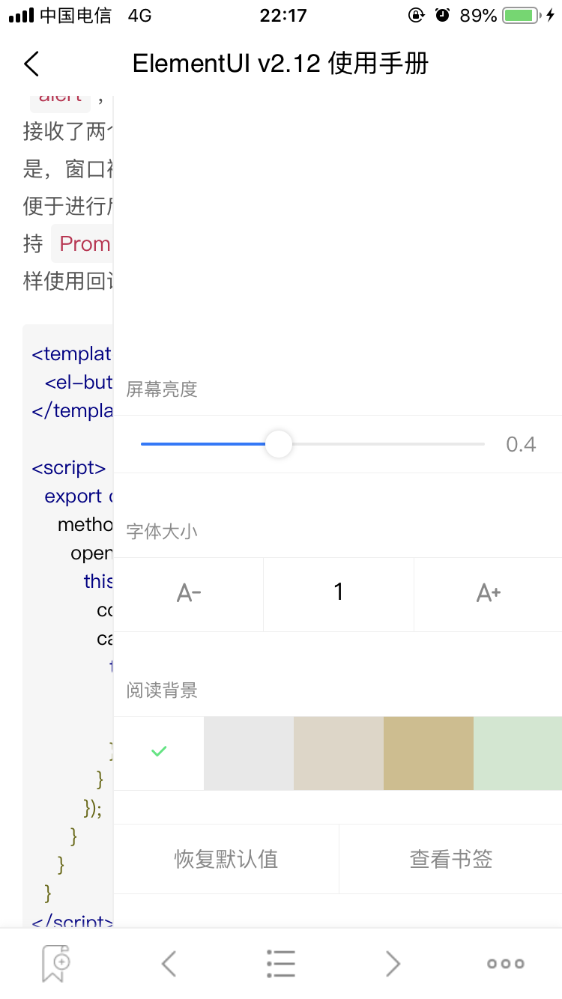
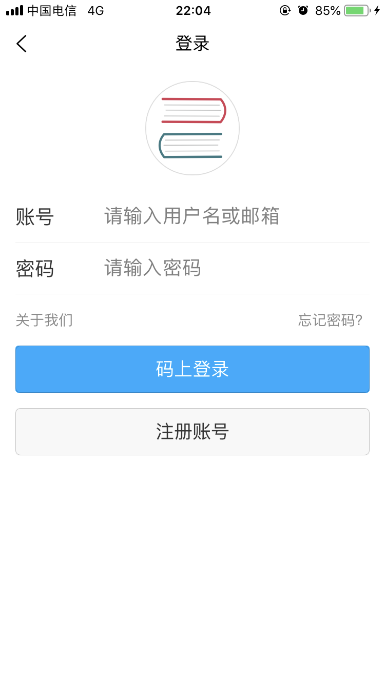
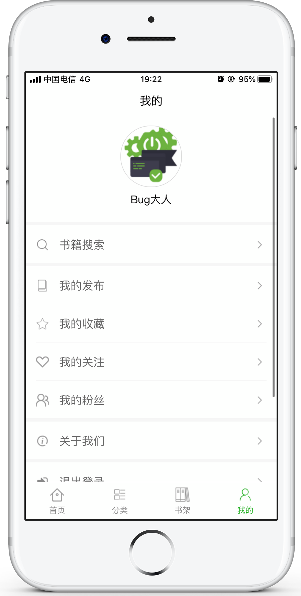
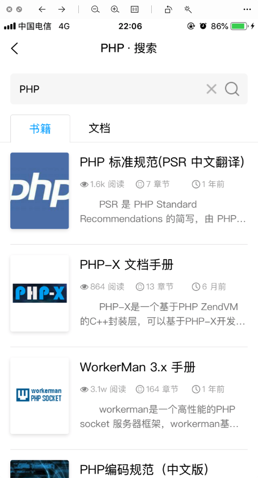

[TOC]

# BookChatApp

通用书籍阅读APP，[BookChat](https://gitee.com/truthhun/BookChat) 的 `uni-app` 实现版本，支持多端分发，编译生成 Android 和 iOS 手机APP以及各平台的小程序。

使用`BookChatApp`，您可以轻松地将您的电子书、文档手册和在线书籍分发到各个小程序平台，以及编译生成手机APP发布到各大手机软件市场供用户下载和使用。

## APP 体验

目前 `BookChatApp` 已经打包编译生成的 Android 和 iOS 手机APP，您可以直接下载体验和感受下。

APP下载体验地址： https://www.bookstack.cn/app

## 设计开发

`BookChatApp`的设计开发跟微信小程序[BookChat](https://gitee.com/truthhun/BookChat)几乎没有两样，如果有不一样的地方，
那就是从微信小程序的原生开发迁移到了使用`uni-app`的vue开发上来。

`BookChatApp`中对HTML内容的渲染，经过多次对性能和渲染效果体验的对比，最终没有采用网上开源的第三方渲染组件，直接使用了`uni-app`自带的`rich-text`组件，
而将`BookChatApp`编译成各平台的小程序的时候，同样也是用了各小程序平台的`rich-text`组件。

## 特点

- 开源：基于 Apache 2.0 开源协议进行开源，对商业友好
- 秀气：简洁、美观，给您焕然一新的视觉体验，让你都不敢相信这是一个擅长后端的程序员设计和开发实现的
- 丰富：注册、登录、搜索、书架、书签、阅读偏好设置等功能齐全，麻雀虽小，五脏俱全
- 强大：尽管`BookChatApp`使用的是混合开发，但是编译生成的手机App以及各平台的小程序，性能和体验也没见得真比原生的差

## 二次开发

可能您对现有程序的功能和主题色调不是很满意，或者有自己的一套UI设计方案，那么，您可以对`BookChatApp`进行二次开发，如果您对`Vue`熟悉。

### 后端程序

`BookChatApp`的配套后端程序是 [BookStack](https://gitee.com/truthhun/BookStack) v2.1 以上版本。

`BookStack`的安装部署教程，看这里--> [BookStack安装部署](https://www.bookstack.cn/read/help/Ubuntu.md)

> 注意： BookStack 的安装部署，不是使用源码进行部署的，而是用编译好了的可执行程序进行部署

**BookStack 开源地址**

- Gitee: https://gitee.com/truthhun/BookStack
- GitHub: https://github.com/truthhun/BookStack

**BookStack 官网**

书栈网： https://www.bookstack.cn

### 二次开发基本步骤

1. 安装部署`BookStack`
1. 克隆下载`BookChatApp`源码
1. 使用`HBuilderX`打开项目文件夹
1. 将下载程序中的`config.example.js`文件重命名为`config.js`文件
1. 根据自己的开发环境，设置`host`配置项

> 如果是在开发环境，请把`debug`设置为true，编译生成生产程序的时候，把`debug`设置为false

## 程序页面

- [x] 目录页            /pages/menu/menu
- [x] 书籍阅读页         /pages/read/read
- [x] 用户中心页         /pages/ucenter/ucenter
- [x] 首页              /pages/index/index
- [x] 分类页            /pages/cate/cate
- [x] 书架页            /pages/bookshelf/bookshelf
- [x] 列表页            /pages/list/list
- [x] 个人主页          /pages/me/me
- [x] 书签页            /pages/bookmarks/bookmarks
- [x] 搜索结果页         /pages/search/search
- [x] 内容点评页         /pages/comment/comment
- [x] 404页            /pages/notfound/notfound
- [x] 登录页            /pages/login/login
- [x] 注册页            /pages/register/register
- [x] 书籍介绍页         /pages/intro/intro

## QQ交流群

QQ交流群：457803862（猿军团）

加群请备注`来自BookChatApp`

说明：

> 该群是一个技术交流群。如果是开源程序遇到问题，请直接提交issues，群里不解答问题.

## 作者介绍

Web 全栈工程师，自带发际线魔法加成，擅长`Ctrl + C` 和 `Ctrl + V`

- 作者：皇虫（TruthHun）
- Email: TruthHun#QQ.COM（把 # 换成 @ ）

## 预览

### 启动页

### 首页

 
 

### 分类页

 
 

### 书架页

 
 

### 书籍介绍页

 
 

### 书籍阅读页

-----

-----

 
 

### 登录

 
 

### 个人中心

 
 

### 搜索

-----

## 开源协议

Apache v2.0

## 赞助

如果您觉得程序还可以，欢迎 start 和 fork，以及赞助我一杯咖啡

