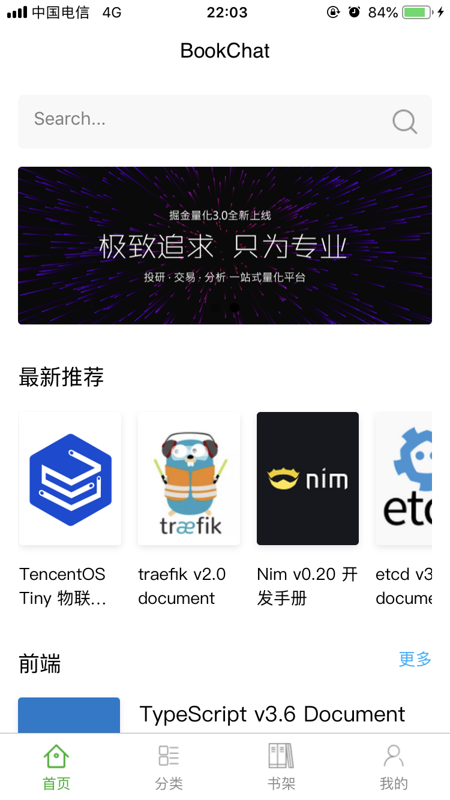
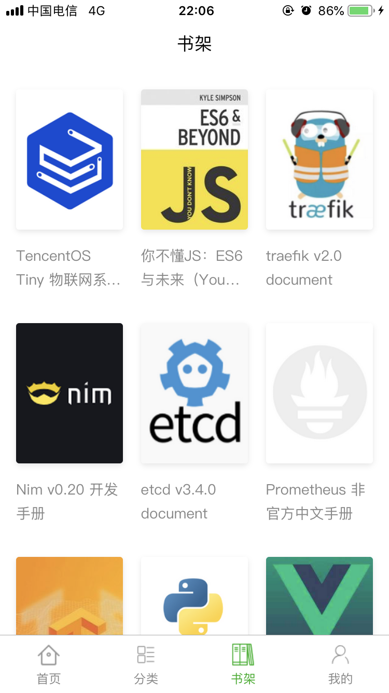
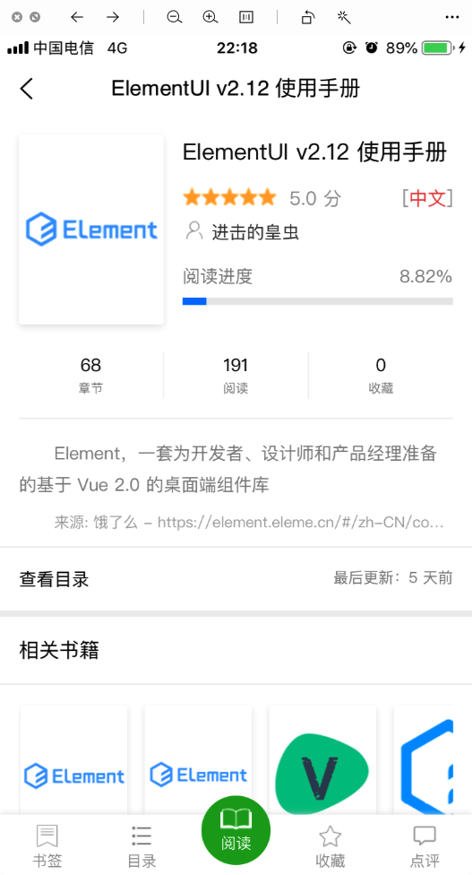
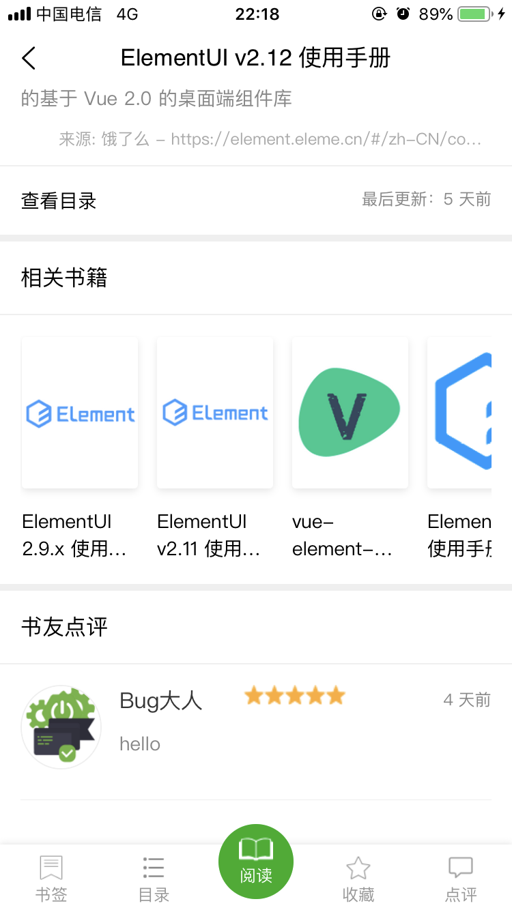
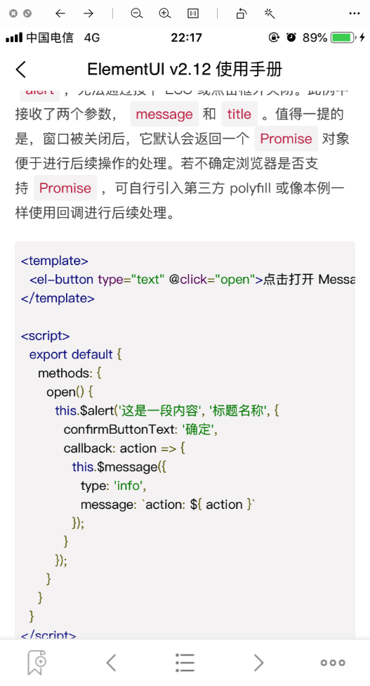
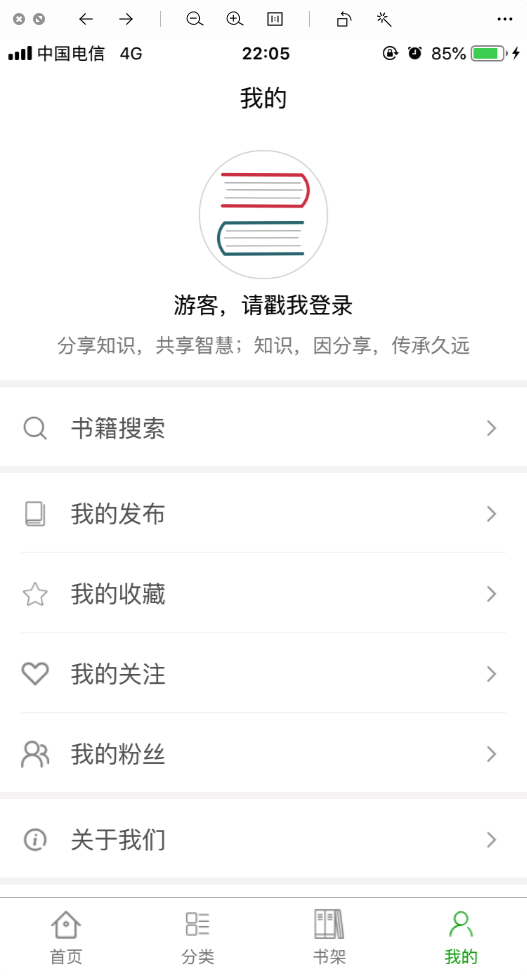
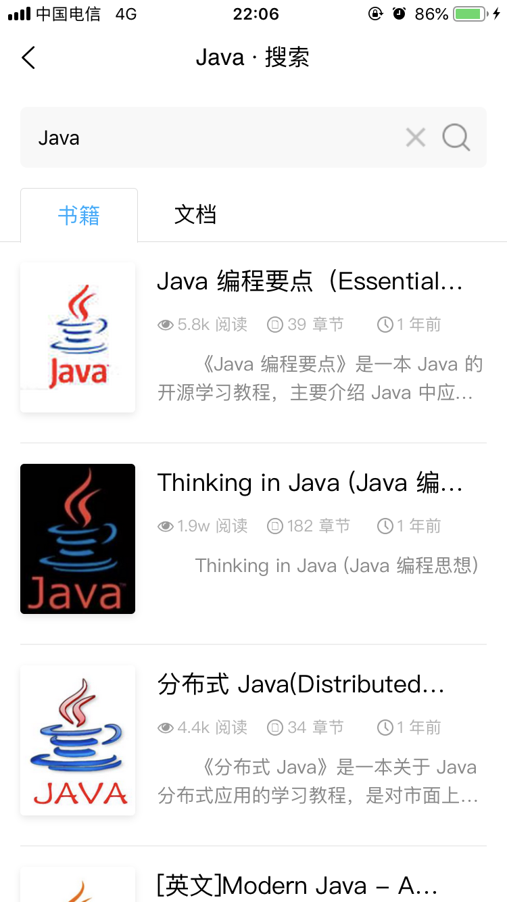

[TOC]

# BookChat

通用书籍阅读APP，[BookChat](https://gitee.com/truthhun/BookChat) 的 uni-app 实现版本，支持多端分发，编译生成Android和iOS 手机APP以及各平台的小程序。

要不是因为提交`BookChat`版本升级被微信以`在线电子书`类目未对个人开放而拒绝了的话，我估计也不会开发`BookChatApp`这个项目。

不过塞翁失马焉知非福，`BookChat`的开发让我熟练了`ES6`，`BookChatApp`的开发让我熟练了`Vue`。

尽管开发途中踩了不少坑，但是开发出来的App在性能和体验上还是可以的。

## 说明

`BookChatApp`的配套后端程序是 `BookStack` v2.1 以上版本。

**BookStack 开源地址**

- Gitee: https://gitee.com/truthhun/BookStack
- GitHub: https://github.com/truthhun/BookStack

**BookStack 官网***

书栈网： https://www.bookstack.cn

## 程序页面

- [x] 目录页 menu
- [x] 书籍阅读页 read
- [x] 用户中心页 ucenter
- [x] 首页 index
- [x] 分类页 cate
- [x] 书架页 bookshelf
- [x] 列表页 list
- [x] 个人主页 me
- [x] 书签页 bookmarks
- [x] 搜索结果页 search
- [x] 内容点评页 comment
- [x] 404页 notfound
- [x] 登录页 login
- [x] 注册页 register
- [x] 书籍介绍页 intro

## 赞助

如果您觉得程序还可以，欢迎 start 和 fork，以及赞助我一杯咖啡

## QQ交流群

QQ交流群：457803862（猿军团）

加群请备注`来自BookChatApp`

说明：

> 该群是一个技术交流群。如果是开源程序遇到问题，请直接提交issues，群里不解答问题.

## 作者介绍

Web 全栈工程师，自带发际线魔法加成，擅长`Ctrl + C` 和 `Ctrl + V`

- 作者：皇虫（TruthHun）
- Email: TruthHun#QQ.COM（把 # 换成 @ ）

## 预览

### 首页

 
 

### 分类页

 
 

### 书架页

 
 

### 书籍介绍页

-----

 
 

### 书籍阅读页

-----

-----

 
 

### 登录

 
 

### 个人中心

 
 

### 搜索

-----

## 开源协议

Apache v2.0